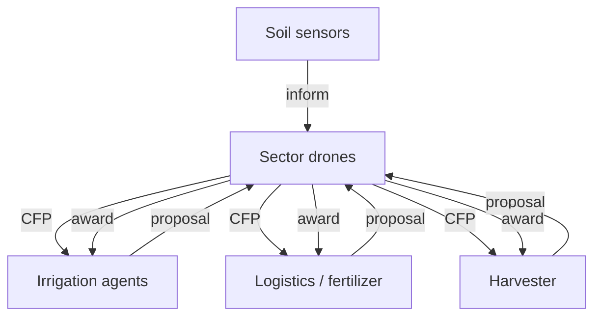

# Precision Farm MAS

A decentralized multi-agent precision-agriculture simulator built around peer-to-peer
coordination and the Contract Net Protocol. It models a smart farm where monitoring,
irrigation, logistics and harvesting agents adapt to drought, pest outbreaks, equipment
failures and constrained resources without a central decision-maker.


## What makes the system interesting

- Two drone agents independently supervise different farm sectors
- Distributed soil sensors publish moisture, nutrient and temperature observations
- Irrigation, fertilizer/logistics and harvester agents bid only on feasible work
- Full Contract Net lifecycle: CFP, proposal, acceptance, rejection and completion
- Explicit water, fertilizer and fuel limits
- Drought, rain, pests, equipment failure and repair events
- Deterministic scenario replay through random seeds
- Inspectable task, event and message histories
- Interactive Streamlit dashboard and a command-line runner
- Optional SPADE/XMPP transport adapter

The assignment screenshots are included in [`enunciado/`](enunciado/), with a readable
summary in [`docs/ENUNCIADO.md`](docs/ENUNCIADO.md).

## Architecture



The simulation advances time and weather, but makes no allocation decisions. Those
belong to the agents. See [`docs/architecture.md`](docs/architecture.md).

## Run on macOS

```bash
brew install python@3.12
python3.12 -m venv .venv
source .venv/bin/activate
python -m pip install --upgrade pip
python -m pip install -e '.[dev]'
```

Run a scenario:

```bash
precision-farm --scenario mixed --ticks 60 --seed 42
```

Launch the dashboard:

```bash
streamlit run app.py
```

The browser opens at `http://localhost:8501`. Change the scenario, resource budget and
seed from the sidebar to compare system behaviour.

## Optional SPADE integration

The default simulator needs no server accounts. To install the SPADE boundary:

```bash
python -m pip install -e '.[spade]'
```

A real XMPP deployment still needs one JID/password per agent. The domain logic remains
unchanged; only the message transport is replaced.

## Tests

```bash
ruff check .
pytest -q
```

## Repository map

```text
precision-farm-mas/
├── app.py                     # interactive dashboard
├── enunciado/                 # original assignment screenshots
├── docs/                      # architecture, requirements and findings
├── results/                   # reproducible example scenarios
├── src/precision_farm/
│   ├── agents/                # autonomous agent behaviours
│   ├── bus.py                 # local peer-to-peer transport
│   ├── models.py              # messages, tasks, zones and resources
│   ├── simulation.py          # physical environment and clock
│   └── spade_runtime.py       # optional SPADE message adapter
└── tests/
```

## Author

Nuno Antunes

